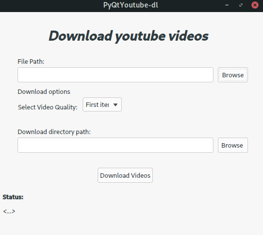

# PyQtYouTube-dl
Gui for downloading youtube videos

*	Checks if youtube-dl is installed on machine
*   Input and output directories can be browsed using the Gui
*	Takes input links from a .txt or .csv file
*	Custom selection option for download directory
*	Renames the downloaded videos from the custom names specified in the input file
​
# Dependencies
+ youtube-dl. Get it here <http://rg3.github.io/youtube-dl/>
+ python 3.0 or higher
​
# Getting ydlfromlist
Clone the repository:
	git clone https://github.com/RaghuKA/PyQtYoutube-dl

