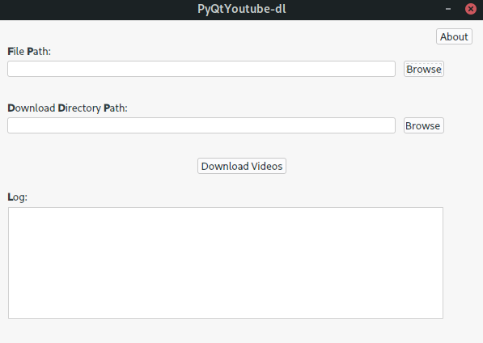

# Description
Video multimedia is very powerful. Many users download videos from youtube due to connection restrictions or to have a collection of videos of own. Single video or a playlist can be downloaded using the youtube_dl command line tool. If several videos from different sources have to be downloaded, this is a convenient way. This tool provides the possibility to specify the different youtube sources and custom names for the videos in a input file (.txt or .csv) and to download the videos at a custom specified directory.

*	Checks if youtube-dl is installed on machine
*   Input and output directories can be browsed using the Gui
*	Takes input links from a .txt or .csv file
*	Custom selection option for download directory
*	Renames the downloaded videos from the custom names specified in the input file
​
# Dependencies
+ youtube-dl. Get it here <http://rg3.github.io/youtube-dl/>
+ python 3.0 or higher
​
# Getting PyQtYouTube-dl
Clone the repository:
	git clone https://github.com/RaghuKA/PyQtYoutube-dl

  

# Usage
​Step 1: Click on the Browse button for File Path. Then browse to the download links input file 
        (.txt or .csv) in  the  Browse input file window and select the input file.

Step 2:	Click on the Browse button for Download Directory Path. Then choose the directory 
        where videos have to be downloaded from the Select directory window.

Step 3: Click on the Download Videos button
​
# Format of videoslist.txt
The file has two components - youtube link and desired filename for the video, all separated by commas. An example file would look like:

    https://www.youtube.com/watch?v=17bgzTfibNo, Vid1
	https://www.youtube.com/watch?v=UPPp8RXXEXY, Vid2
​
Two videos will be downloaded in succession.